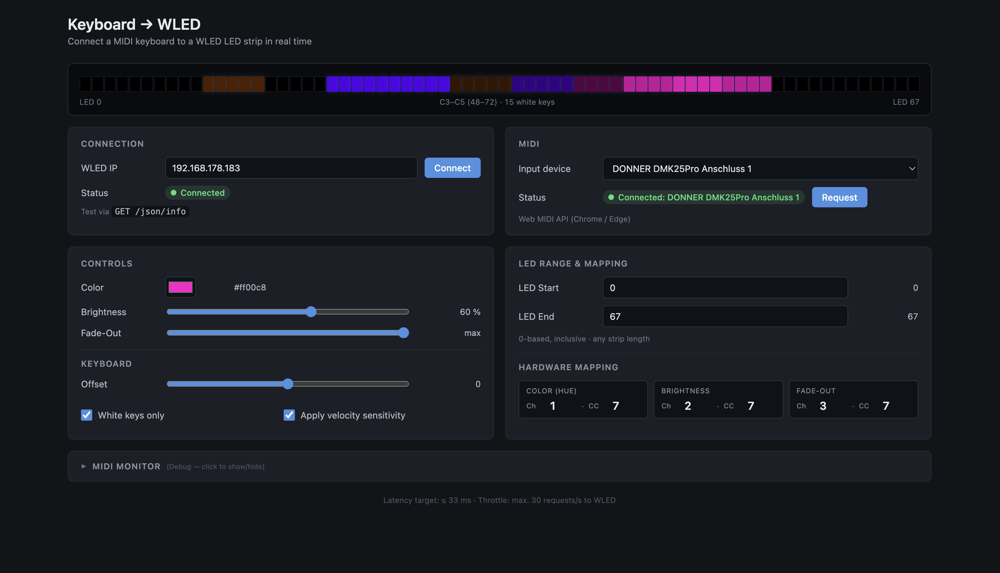

# Keyboard → WLED

Browser tool that connects a MIDI keyboard in real time to a WLED-controlled LED strip. Key press → LED segment lights up, release → configurable fade-out. Polyphonic, velocity-sensitive, with live visualization.

---

## Screenshots

---

## Features

- **Polyphonic** — up to 25 keys at once, each with its own fade state
- **Velocity-sensitive** — strike strength scales brightness (can be disabled)
- **White-keys-only mode** — black keys can optionally be ignored
- **Octave offset** — shift the keyboard in semitones
- **Hardware CC mapping** — three knobs of a MIDI controller for color, brightness, fade-out
- **Variable strip length** — LED range freely configurable (no hard maximum)
- **Live visualization** — individual LEDs in the browser, in sync with WLED
- **MIDI monitor** — debug view for incoming MIDI messages (collapsible)
- **30 req/s throttle** — WLED-compliant, max. one request per 33 ms

---

## Requirements

| Component | Requirement |
|---|---|
| **Browser** | Chrome 90+ or Edge 90+ (Web MIDI API, not available in Firefox) |
| **MIDI keyboard** | USB MIDI controller, tested with Donner DMK 25 Pro |
| **WLED** | Reachable on the local network, JSON API enabled (default) |

---

## How-To

### 1. Upload to WLED

The page runs as a static HTML file inside the WLED filesystem — no install, no build, no extra server. The WLED device serves the file itself, so the page is on the **same origin** as the JSON API and CORS is a non-issue.

1. Open the WLED web UI (e.g. `http://192.168.x.x`)
2. Click the **File Editor** button in the UI (located just under the color palette)
3. Upload `keyboard-wled.html` from this repo
4. The page is now reachable at `http://<wled-ip>/keyboard-wled.html`

### 2. Open the page

Navigate to `http://<wled-ip>/keyboard-wled.html` in Chrome or Edge. Bookmark it for next time.

### 3. Connect to WLED

1. The **"WLED IP"** field is prefilled with the page's host (the WLED device). Change it only if the WLED API is on a different host.
2. Click the **"Connect"** button — tests via `GET /json/info`
3. Status should switch to green "Connected"

### 4. Enable MIDI

1. Click the **"Request"** button in the MIDI card
2. The browser asks for MIDI permission — confirm
3. Pick a device (e.g. "Donner DMK 25 Pro") from the dropdown
4. Status switches to green "Connected"

### 5. Play

Press keys — the LEDs light up in real time; on release the brightness fades to 0 over the configured fade-out time.

---

### Alternative: run the file from your computer

For development or if you don't want to upload to WLED, you can also open `keyboard-wled.html` directly:
- **Double-click** the file → `file:///path/to/keyboard-wled.html`
- Or via a local web server, e.g. `python3 -m http.server` in the file's directory, then `http://localhost:8000`

⚠️ In this case the page is served from a different origin than the WLED API, so the browser will block the JSON requests. Install e.g. [CORS Unblock](https://chromewebstore.google.com/detail/cors-unblock/lfhmikememgdcahcdlaciloancbhjino) (Chrome/Edge) or "CORS Everywhere" (Firefox) to allow them. **This is not needed when the page is hosted on WLED itself.**

---

## Configuration

### LED range

| Field | Default | Function |
|---|---|---|
| **LED Start** | `0` | First LED index of the controlled range |
| **LED End** | `78` | Last LED index (inclusive) |

No hard maximum — works with any strip length. The visualization shows up to 500 LEDs.

### Keyboard

- **Offset** (slider, −36 … +36 semitones): shifts the active MIDI range. Default `0` = Donner's default octave C3–C5. `+` = lower, `−` = higher.
- **White keys only** (default on): ignores C#, D#, F#, G#, A#. The 15 white keys per range are distributed evenly across the LED range.
- **Apply velocity sensitivity** (default on): velocity scales the brightness. Off = always 100 % of the brightness slider setting.

### Controls

- **Fade-Out** (0–3000 ms): decay time after release, default `300 ms`
- **Brightness** (0–100 %): maximum brightness at velocity 127, default `100 %`
- **Color** (RGB color picker): default `#ff6400`

### MIDI CC mapping (Donner DMK 25 Pro)

The DMK 25 Pro sends CC #7 on channels 1/2/3 for the three knobs. Default mapping in the app:

| Knob | Ch | CC | Function |
|---|---|---|---|
| 1 | 1 | 7 | **Color** (hue) |
| 2 | 2 | 7 | **Brightness** |
| 3 | 3 | 7 | **Fade-Out** |

Other controllers: simply adjust the `Ch` and `CC` values in the cells. `Ch = 0` matches on any channel. Check the current mapping in the MIDI monitor (expand the details).

---

## Troubleshooting

### "WLED not reachable" despite correct IP

1. **Page hosted on the WLED device?** If you opened the HTML from disk or a local server, the browser blocks the cross-origin requests — upload the file to WLED via the File Editor, or install a CORS unblocker. See [Alternative: run the file from your computer](#alternative-run-the-file-from-your-computer).
2. **IP address correct?** Test directly in the browser: `http://<ip>/json/info` must return JSON.
3. **Same network?** Some routers have AP isolation (Wi-Fi clients cannot see each other).
4. **WLED firmware up to date?** The JSON API has been standard for a long time, but old versions may cause issues.

### "MIDI access denied"

- **Use Chrome or Edge** — Firefox has no Web MIDI API.
- Check the browser's MIDI permission in the browser settings (site permissions) and set it to "Allow".

### Keys light up at the wrong position

- **Adjust the offset**: ±12 semitones = one octave. If your keyboard sends in a different octave (e.g. via the octave buttons on the controller), adjust the value here.
- **Check the LED range** — it must match the physical strip. If the leftmost LED of your strip is not at index 0, adjust the start value.
- **Disable white keys only** if you also want to control black keys.

### Hardware knobs have no effect

1. Expand the **MIDI Monitor** at the bottom of the page.
2. Turn a knob — do `CC` entries appear? If not: the knobs are not sending CC messages (enable them in the controller's setup).
3. If yes: compare the displayed `Ch` and `CC` values with the values in the three knob cells and adjust if needed.

### Fade-out stutters or breaks off

- Close other tabs/programs that claim MIDI devices
- Enable browser hardware acceleration (`chrome://settings/system`)
- Close other web pages with high CPU load (otherwise the rAF loop gets throttled)

---

## Technical details

- **A single HTML file** — no build step, no dependencies, no server component
- **Latency:** ≤ 33 ms (throttle at 30 req/s)
- **Polyphonic fade:** `Map<note, {brightness, fadeStartTime, isFading}>`, `requestAnimationFrame` loop. Each note fades independently — simultaneous keys do not block each other.
- **Retriggering:** a new strike during fade cancels the fade and restarts with the new velocity.
- **WLED payload format:** `{ "seg": [{ "id": 0, "i": [idx, [r,g,b], idx, [r,g,b], …] }] }`
- **Throttle implementation:** timestamp comparison + `setTimeout` to batch multiple changes within a 33 ms window
- **Visualization cap:** 500 divs (performance). For longer strips the visualization is truncated, but the WLED communication works with the full length.

---

## Known limitations

- **Chrome/Edge only** because of the Web MIDI API
- **Hosted on the WLED filesystem** — needs the File Editor / filesystem-write access on the device; occupies a few KB of flash
- **No native WLED integration** — external tool, not a usermod
- **Visualization limited to 500 LEDs** (browser performance protection)
